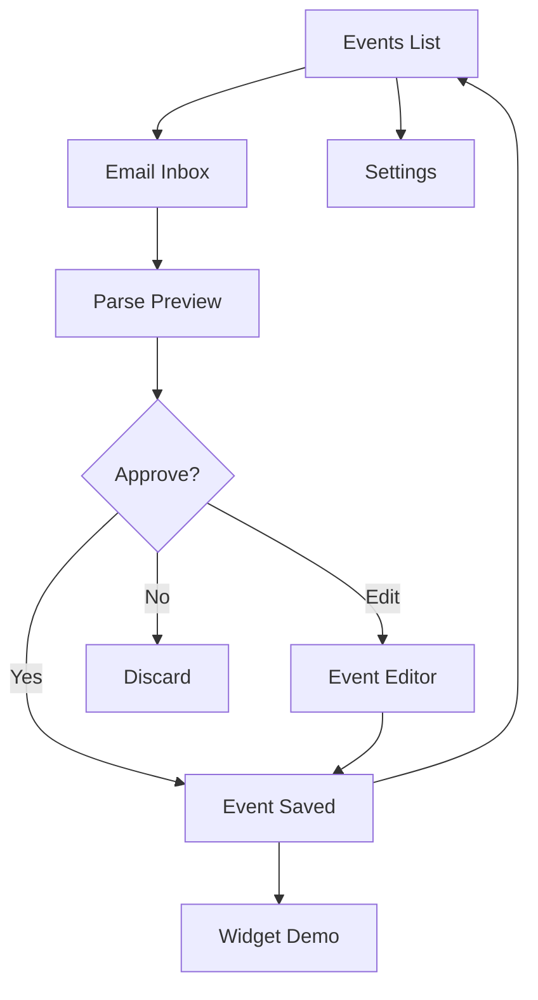

## 1. Product Overview

Email-to-Event AI Widget App automatically parses transactional emails and converts them into actionable events. Users can approve, edit, or ignore extracted events while AI tracks follow-ups for updates.

**Problem Solved:** Eliminates manual tracking of deliveries, bookings, tickets, and appointments scattered across email inbox.

**Target Users:** Anyone receiving transactional emails about travel, deliveries, appointments, subscriptions, or tickets.

## 2. Core Features

### 2.1 User Roles
| Role | Registration Method | Core Permissions |
|------|---------------------|------------------|
| User | Local app usage | Create, edit, delete events; view widget; receive notifications |

### 2.2 Feature Module
Our email-to-event app consists of the following main pages:
1. **Events List**: View all parsed events with swipe actions
2. **Email Inbox**: Mock email list for demonstration
3. **Parse Preview**: Side-by-side email and extracted event view
4. **Event Editor**: Edit event details before saving
5. **Widget Demo**: Swipeable carousel of today's events
6. **Settings**: Theme toggle and developer options

### 2.3 Page Details
| Page Name | Module Name | Feature description |
|-----------|-------------|---------------------|
| Events List | Event Cards | Display parsed events with title, date, location, and status |
| Events List | Pull Refresh | Refresh event list with smooth animation |
| Events List | FAB Button | Floating action button to manually add events |
| Email Inbox | Email Cards | Show mock emails with sender icons and preview text |
| Email Inbox | Parse Action | Tap email to trigger AI parsing demonstration |
| Parse Preview | Side-by-side View | Display original email content and extracted event details |
| Parse Preview | Approval Actions | Approve, edit, or reject extracted events |
| Event Editor | Input Fields | Edit title, date, time, location, and notes |
| Event Editor | Date/Time Pickers | Native date and time selection controls |
| Widget Demo | Swipeable Cards | Horizontal carousel of event cards |
| Widget Demo | Theme Toggle | Switch between light and dark themes |
| Settings | Theme Control | Toggle app-wide light/dark mode |
| Settings | Developer Mode | Show mock JSON data for debugging |

## 3. Core Process

**Main User Flow:**
1. User opens app → sees Events List
2. Taps Email tab → views mock emails
3. Taps an email → Parse Preview opens
4. Reviews extracted event → approves or edits
5. Event appears in Events List and Widget Demo
6. Widget shows swipeable cards of today's events

## 4. User Interface Design

### 4.1 Design Style
- **Primary Colors:** Deep purple (#6B46C1) with glassmorphism effects
- **Secondary Colors:** Soft gradients with transparency (20-40% opacity)
- **Button Style:** Rounded rectangles with subtle shadows and blur effects
- **Typography:** SF Pro Display inspired, large headers (24-32px), readable body (16px)
- **Layout Style:** Card-based with generous spacing (8pt grid system)
- **Icons:** Monochrome with rounded corners, consistent line weight
- **Backgrounds:** Blurred glass effects with subtle noise texture

### 4.2 Page Design Overview
| Page Name | Module Name | UI Elements |
|-----------|-------------|-------------|
| Events List | Event Cards | Glassmorphism cards with 28px rounded corners, subtle shadows, swipe actions |
| Events List | Header | Large title (28px), pull-to-refresh indicator with spring animation |
| Email Inbox | Email Cards | Sender avatars, preview text truncation, unread indicators |
| Parse Preview | Split View | Blurred background, glass panels for email and event content |
| Parse Preview | Action Buttons | Primary purple buttons with 12px rounded corners, clear hierarchy |
| Event Editor | Form Fields | Rounded input fields with 8px corners, floating labels, validation states |
| Widget Demo | Carousel Cards | Full-width cards with horizontal swipe, page indicators, smooth transitions |

### 4.3 Responsiveness
- **Mobile-first design** optimized for iOS and Android
- **Touch interactions** with haptic feedback
- **Gesture support** for swipe actions and carousel navigation
- **Adaptive layouts** for different screen