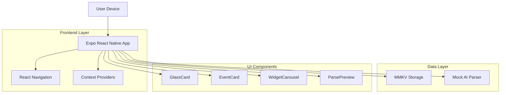
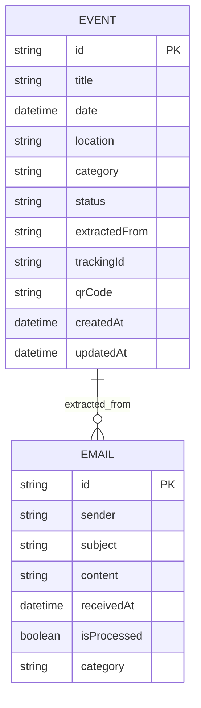
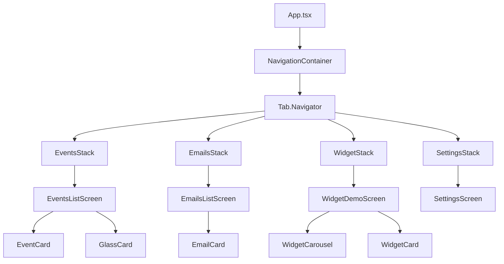

## 1. Architecture Design



## 2. Technology Description

- **Frontend:** React Native@0.72 + Expo@49 + TypeScript@5
- **Initialization Tool:** Expo CLI
- **Navigation:** @react-navigation/native@6 + @react-navigation/bottom-tabs@6
- **Storage:** react-native-mmkv@2.10 for local persistence
- **Animations:** moti@0.25 for smooth transitions
- **Styling:** NativeWind@2.0 (Tailwind for React Native)
- **Backend:** None (local-only MVP)

## 3. Route Definitions

| Route | Purpose |
|-------|---------|
| / | Events List - Main screen showing parsed events |
| /emails | Email Inbox - Mock email list for demonstration |
| /parse/:emailId | Parse Preview - Show email content and extracted event |
| /edit/:eventId | Event Editor - Modify event details |
| /widget | Widget Demo - Swipeable carousel view |
| /settings | Settings - Theme and app preferences |

## 4. API Definitions

### 4.1 Core Data Types

```typescript
// Event interface
interface Event {
  id: string;
  title: string;
  date: Date;
  location?: string;
  category: 'delivery' | 'travel' | 'appointment' | 'ticket' | 'subscription';
  status: 'pending' | 'approved' | 'rejected';
  extractedFrom?: string;
  trackingId?: string;
  qrCode?: string;
  createdAt: Date;
  updatedAt: Date;
}

// Email interface
interface MockEmail {
  id: string;
  sender: string;
  subject: string;
  content: string;
  receivedAt: Date;
  isProcessed: boolean;
  category?: string;
}

// Parsed event from email
interface ParsedEvent {
  title: string;
  date: Date;
  location?: string;
  category: string;
  confidence: number;
  trackingId?: string;
  rawExtractions: Record<string, any>;
}
```

### 4.2 Mock AI Parser API

```typescript
// Email parsing function
export const mockParseEmailToEvent = (email: MockEmail): ParsedEvent => {
  // Extract date patterns: MM/DD/YYYY, DD Month YYYY, etc.
  const dateRegex = /(\d{1,2}\/\d{1,2}\/\d{4}|\d{1,2} \w+ \d{4})/g;
  const timeRegex = /(\d{1,2}:\d{2} (AM|PM|am|pm))/g;
  const trackingRegex = /(tracking|order|confirmation|reference).*?[:#]\s*(\w+)/gi;
  
  // Category detection based on sender and content
  const detectCategory = (sender: string, content: string): string => {
    const categories = {
      delivery: ['amazon', 'fedex', 'ups', 'dhl', 'delivery'],
      travel: ['airline', 'flight', 'booking', 'hotel', 'expedia'],
      appointment: ['appointment', 'meeting', 'reservation'],
      ticket: ['ticket', 'event', 'concert', 'movie'],
      subscription: ['subscription', 'renewal', 'billing']
    };
    
    for (const [category, keywords] of Object.entries(categories)) {
      if (keywords.some(keyword => 
        sender.toLowerCase().includes(keyword) || 
        content.toLowerCase().includes(keyword)
      )) {
        return category;
      }
    }
    return 'appointment';
  };
  
  // Extract relevant information
  const extractedDate = email.content.match(dateRegex)?.[0];
  const extractedTime = email.content.match(timeRegex)?.[0];
  const trackingMatch = email.content.match(trackingRegex);
  const trackingId = trackingMatch ? trackingMatch[2] : undefined;
  
  return {
    title: email.subject.replace(/^(Re:|Fwd?:)\s*/i, ''),
    date: new Date(extractedDate || Date.now()),
    location: undefined, // Extract from content if available
    category: detectCategory(email.sender, email.content),
    confidence: Math.random() * 0.3 + 0.7, // 70-100% confidence
    trackingId,
    rawExtractions: {
      date: extractedDate,
      time: extractedTime,
      sender: email.sender
    }
  };
};
```

## 5. State Management Architecture

```mermaid
graph TD
    A[App Root] --> B[EventContext]
    A --> C[EmailContext]
    A --> D[ThemeContext]
    
    B --> E[events: Event[]]
    B --> F[addEvent: Function]
    B --> G[editEvent: Function]
    B --> H[removeEvent: Function]
    
    C --> I[emails: MockEmail[]]
    C --> J[processEmail: Function]
    C --> K[getUnprocessed: Function]
    
    D --> L[theme: 'light' | 'dark']
    D --> M[toggleTheme: Function]
    
    E --> N[MMKV Storage]
    I --> O[MMKV Storage]
    L --> P[MMKV Storage]
```

## 6. Data Model

### 6.1 Local Storage Schema



### 6.2 MMKV Storage Keys

```typescript
// Storage keys for MMKV
const STORAGE_KEYS = {
  EVENTS: 'email_events_v1',
  EMAILS: 'mock_emails_v1',
  SETTINGS: 'app_settings_v1',
  THEME: 'app_theme_v1'
} as const;

// Storage interface
interface AppStorage {
  events: Event[];
  emails: MockEmail[];
  settings: {
    theme: 'light' | 'dark';
    notifications: boolean;
    developerMode: boolean;
  };
}
```

## 7. Component Architecture

### 7.1 Core Components Hierarchy



### 7.2 Reusable Components

- **GlassCard**: Glassmorphism container with blur effects
- **EventCard**: Display event information with swipe actions
- **EmailCard**: Show email preview with sender information
- **WidgetCard**: Carousel card for widget demonstration
- **ParseInfoRow**: Display extracted information in parse preview
- **ButtonPrimary/Secondary**: Consistent button styling
- **TextInputField**: Form input with validation states

## 8. Mock Data Structure

```typescript
// Mock email templates
const MOCK_EMAILS: MockEmail[] = [
  {
    id: '1',
    sender: 'Amazon Orders',
    subject: 'Your package will arrive tomorrow',
    content: 'Your order #12345 will be delivered on December 15, 2024 between 2:00 PM - 6:00 PM. Track your package at amazon.com/track',
    receivedAt: new Date('2024-12-14T10:30:00'),
    isProcessed: false,
    category: 'delivery'
  },
  {
    id: '2',
    sender: 'Delta Airlines',
    subject: 'Flight Confirmation - DL1234',
    content: 'Your flight DL1234 from JFK to LAX on December 20, 2024 at 8:30 AM. Confirmation: ABC123. Gate information available 24 hours before departure.',
    receivedAt: new Date('2024-12-13T14:20:00'),
    isProcessed: false,
    category: 'travel'
  }
];

// Mock event templates
const MOCK_EVENTS: Event[] = [
  {
    id: '1',
    title: 'Package Delivery - Amazon',
    date: new Date('2024-12-15T16:00:00'),
    location: 'Home Address',
    category: 'delivery',
    status: 'approved',
    trackingId: '12345',
    createdAt: new Date('2024-12-14T10:35:00'),
    updatedAt: new Date('2024-12-14T10:35:00')
  }
];
```

## 9. Future AI Integration Plan

### 9.1 Cactus SDK Integration Points

1. **Email Parsing**: Replace `mockParseEmailToEvent` with Cactus SDK inference
2. **Event Classification**: Use on-device model for category detection
3. **Follow-up Detection**: Semantic matching for related emails
4. **Smart Summaries**: Generate weekly/monthly event summaries
5. **Confidence Scoring**: AI-powered extraction confidence

### 9.2 Integration Architecture

```typescript
// Future AI service interface
interface AIService {
  parseEmail(email: MockEmail): Promise<ParsedEvent>;
  classifyEvent(event: Event): Promise<string>;
  findRelatedEvents(events: Event[], newEvent: Event): Promise<Event[]>;
  generateSummary(events: Event[]): Promise<string>;
}

// Cactus SDK implementation
class CactusAIService implements AIService {
  private sdk: CactusSDK;
  
  async parseEmail(email: MockEmail): Promise<ParsedEvent> {
    // Use Cactus SDK for inference
    const result = await this.sdk.infer({
      model: 'email-parser-v1',
      input: email.content
    });
    
    return this.mapToParsedEvent(result);
  }
  
  // Additional methods...
}
```

## 10. Performance Considerations

- **Local Storage**: MMKV provides sub-millisecond read/write performance
- **Image Optimization**: Lazy loading for event attachments
- **Animation Performance**: Use native drivers for smooth 60fps animations
- **Memory Management**: Implement virtual scrolling for large event lists
- **Bundle Size**: Tree-shake unused components and optimize assets